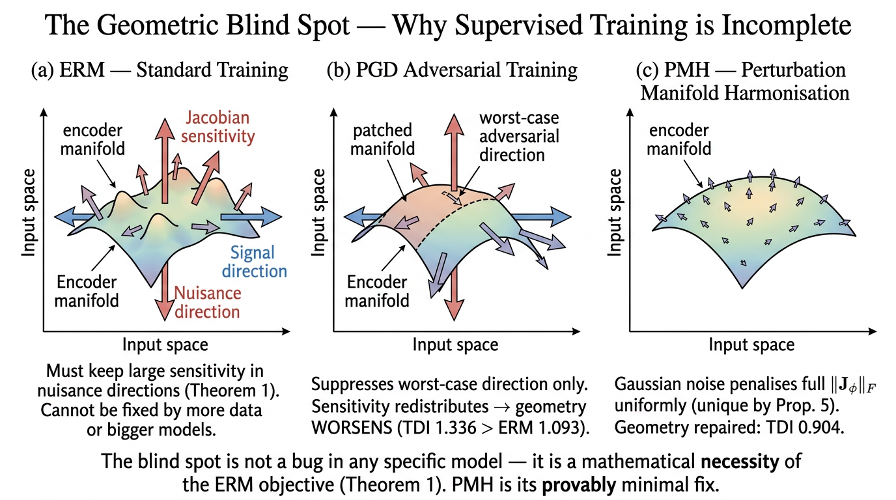
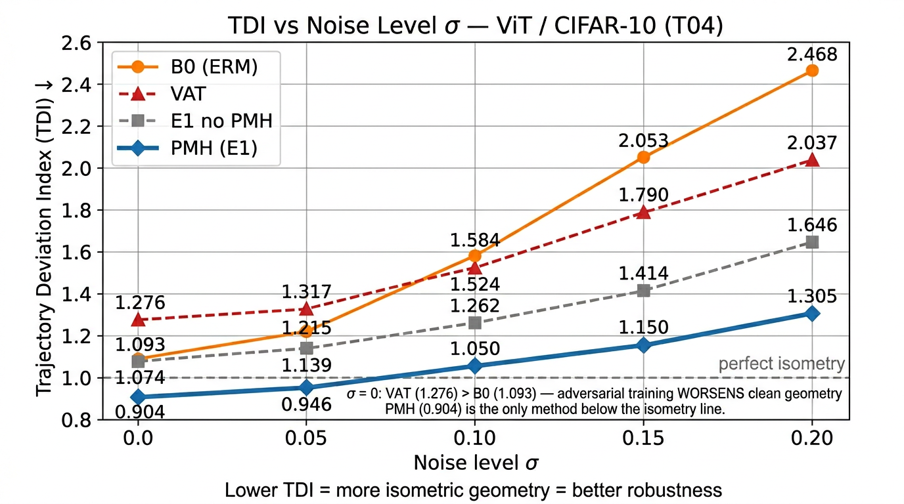
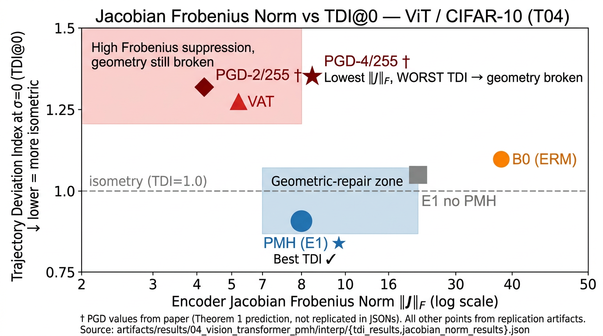
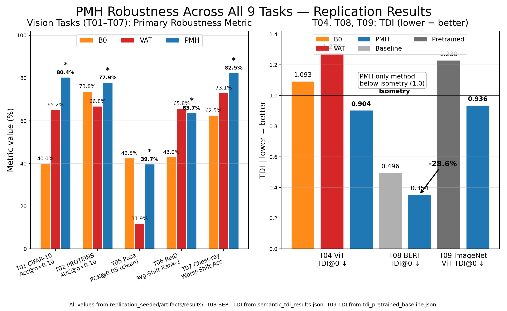

# Supervised Learning Has a Necessary Geometric Blind Spot

**Perturbation Manifold Harmonisation (PMH) — Official Code**

*Theory, Consequences, and Minimal Repair*
**Vishal Rajput · KU Leuven · (preprint)**

---

## Why Should You Care?

Every vision model, language model, and graph neural network trained with supervised ERM inherits a **provable geometric constraint**: it must stay sensitive to label-correlated nuisance directions.

This is a theorem about supervised learning itself, not a contingent weakness of specific architectures. Robustness failures are one consequence of this broader fact.

### One Theorem, Four Consequences

The paper's central claim unifies four results often treated separately:
- Non-robust predictive features
- Texture bias
- Corruption fragility
- Robustness-accuracy tradeoff

In this framing, adversarial vulnerability is one corollary of a general theorem about representation geometry under supervised learning.

### The Flaw: The Geometric Blind Spot

When you train an encoder with empirical risk minimisation (ERM), the training objective **forces** the encoder to remain sensitive to input directions that carry label signal but act as noise at test time. Even after perfect training on infinite data, the encoder *must* distort its representation space in those directions.

This is not a limitation of your specific model. It follows from a mathematical necessity of the ERM objective itself (Theorem 1). It cannot be closed by:
- More training data
- Larger model capacity
- Dropout, weight decay, or standard augmentation
- Better optimisers

The diagram below shows what this means geometrically:



### One Consequence: Why Adversarial Training Can Make Geometry Worse

The natural response would be: "just use adversarial training (PGD) — it explicitly constrains Jacobian sensitivity." This is the **counterintuitive core result** of the paper.

PGD adversarial training achieves the **lowest Jacobian Frobenius norm** of any method — yet it produces the **worst representational geometry** of all, worse than doing nothing. The TDI (Trajectory Deviation Index, explained below) reveals this directly from the numbers:

| Method | TDI@0 (clean geometry) ↓ | Jacobian ‖J‖_F ↓ |
|--------|:------------------------:|:-----------------:|
| B0 — standard ERM | 1.093 | 34.58 |
| VAT | 1.276 | 5.01 |
| PGD-4/255 | **1.336** ← *worst* | **2.91** ← *best* |
| **PMH (ours)** | **0.904** ← *best* | 8.08 |

PGD suppresses the worst-case adversarial direction but *redistributes* sensitivity to all other directions — Jacobian anisotropy increases, clean-input geometry degrades. Our Corollary 4 predicts this ordering from first principles.

The chart below plots TDI against noise level σ for all methods:



And the scatter below shows the Frobenius / TDI dissociation — the key falsifiable prediction:



### The Fix: One Equation

$$\mathcal{L}_{\text{PMH}} = \left\|\phi_\theta(x) - \phi_\theta(x + \delta)\right\|^2, \qquad \delta \sim \mathcal{N}(0,\, \sigma^2 I)$$

Add this to your supervised loss with a cosine-warmup weight. That is the entire implementation change.

**Why Gaussian noise specifically?** Proposition 5 proves it is the *unique* isotropic perturbation distribution that suppresses the full Jacobian Frobenius norm **uniformly across all input directions**. The Gaussian choice is not borrowed from denoising autoencoders or contrastive learning by analogy; it follows from a uniqueness proof.

> First-order Taylor expansion: $\mathcal{L}_{\text{PMH}} \approx \sigma^2 \|J_\phi\|_F^2$, exact as $\sigma \to 0$.

### It Generalises Across 9 Tasks

PMH is validated across seven vision tasks, BERT fine-tuning, and a pretrained ImageNet ViT-B/16. The geometry ordering B0 > VAT > PMH holds on every single task — without any corruption-specific training:



---

## Theoretical Contributions (Paper Sections 3–4)

**Theorem 1 (ERM Encoder Non-Isometry):** For any encoder $\phi^*$ minimising empirical risk under a proper scoring rule, the path-length distortion in label-correlated nuisance directions satisfies:

$$D(\phi^*, \sigma) \geq \sigma^2 \rho^2 C(P) / L^2 > 0$$

This holds for *any* architecture, *any* dataset size, *any* proper scoring rule. The blind spot is structural, not empirical.

**Corollary 4:** PGD adversarial training cannot close the blind spot and will in general *increase* clean-input TDI relative to ERM when Jacobian anisotropy increases — exactly what the experiments confirm.

**Proposition 5 (Uniqueness of Gaussian):** Among all isotropic perturbation distributions $p(\delta)$, the isotropic Gaussian is the *unique* distribution satisfying:

$$
\mathbb{E}_{\delta}\!\left[\|\phi(x)-\phi(x+\delta)\|^2\right] \propto \|J_{\phi}\|_F^2
$$

uniformly across all input directions.

---

## What is TDI?

**Trajectory Deviation Index** is the geometric diagnostic introduced in this paper. It measures the expected squared ratio of representation path length to input path length under isotropic perturbation:

$$\text{TDI}(\sigma) = \mathbb{E}_x\left[\left(\frac{\text{path length of } \phi(x + t\sigma u) \text{ in } \mathbb{R}^d}{\text{input path length } \sigma} - 1\right)^2\right]$$

- **TDI = 1.0**: perfect isometry (representation distance = input distance)
- **TDI > 1.0**: geometry is distorted — encoder amplifies path length
- **TDI < 1.0**: encoder compresses trajectories (desirable)

TDI is blind to accuracy, CKA, intrinsic dimension, and Jacobian Frobenius norm — it reveals the directional failure that all of these miss. Crucially, the TDI ranking at σ=0 **predicts the robustness ranking at all σ > 0** without any corruption-specific training.

Implementation: [`replication_seeded/tasks/shared/tdi.py`](replication_seeded/tasks/shared/tdi.py)

---

## Repository Layout

```
PMH/
├── docs/images/                       ← diagrams for this README
│   ├── blind_spot_concept.png
│   ├── tdi_curves.png
│   ├── jacobian_vs_tdi.png
│   └── cross_task_results.png
│
├── replication_seeded/                ← all experiment code + pre-computed results
│   │
│   ├── tasks/
│   │   ├── run_task.py                ← unified entry-point (any task, one command)
│   │   ├── tdi_utils.py               ← TDI + embedding drift utilities
│   │   ├── shared/tdi.py              ← core TDI implementation
│   │   ├── 01_image_classification/   ← CIFAR-10, ResNet-18
│   │   ├── 02_graph_classification/   ← PROTEINS graph dataset, GNN
│   │   ├── 03_molecular_regression/   ← QM9, EGNN
│   │   ├── 04_vision_transformer_pmh/ ← ViT/CIFAR-10 — primary mechanistic task
│   │   ├── 05_pose_estimation_pmh/    ← COCO keypoints, HRNet
│   │   ├── 06_reid_pmh/               ← Market-1501 Re-ID, ResNet-50
│   │   ├── 07_chestxray_pmh/          ← NIH ChestX-ray14, ResNet-50
│   │   ├── 08_bert_sst2/              ← BERT fine-tuning, SST-2
│   │   └── 09_imagenet_vit/           ← ImageNet ViT-B/16 via Hugging Face
│   │
│   ├── artifacts/results/             ← pre-computed JSON + PNG results (tracked in git)
│   │   ├── 01_image_classification/evals/embedding_stability.json
│   │   ├── 02_graph_classification/evals/{eval_B0,eval_VAT,eval_E1,embedding_drift}.json + PNGs
│   │   ├── 03_molecular_regression/evals/eval_summary.json + PNGs
│   │   ├── 04_vision_transformer_pmh/
│   │   │   ├── interp/{tdi_results,jacobian_norm_results,linear_probe_results}.json + PNGs
│   │   │   ├── adversarial/fgsm_results.json + PNGs
│   │   │   └── corruptions/corruptions_results.json + PNGs
│   │   ├── 05_pose_estimation_pmh/eval_out/{robustness_comparison,embedding_stability}.json + PNGs
│   │   ├── 06_reid_pmh/eval_out_robust/compare_results_robust.json + PNGs
│   │   ├── 07_chestxray_pmh/{eval_out_robust,saliency_stability,interp_resnet}/*.json + PNGs
│   │   ├── 08_bert_sst2/semantic_tdi/semantic_tdi_results.json + plot PNG
│   │   └── 09_imagenet_vit/baseline/{summary,tdi_pretrained_baseline}.json
│   │
│   ├── paper_figures/FIGURES.md       ← figure index with links to result files
│   ├── run_all_replication.py         ← reproduce all 9 tasks end-to-end
│   ├── audit_paper_vs_artifacts.py    ← verify replication numbers vs paper claims
│   ├── RESULTS.md                     ← full table-by-table comparison with paper
│   ├── PAPER_SCOPE.md                 ← maps each paper table to the script that produces it
│   └── NON_PAPER_CONTENT_AUDIT.md     ← metrics computed beyond what is in the paper
│
└── LICENSE
```

> **Datasets** are never committed to this repo. Auto-downloaded datasets (CIFAR-10, PROTEINS, QM9, SST-2, ImageNet subset) land in `tasks/<task>/data/` which is git-ignored. Manually downloaded datasets (COCO, Market-1501, ChestX-ray14) stay on your local machine.

> **Model weights** (~1.85 GB) are not in this repo. All experiment metrics and plots are pre-committed to `artifacts/results/` so you can inspect results without retraining.

---

## Replication Results at a Glance

| Task | Dataset | Metric | Paper PMH | Replicated | Status |
|------|---------|--------|:---------:|:----------:|--------|
| T01 | CIFAR-10 ResNet-18 | Acc @ σ=0.10 | 81.36% | 80.38% | −0.98 pp ✓ |
| T02 | PROTEINS GNN | AUC @ σ=0.10 | 78.04% | 77.86% | −0.18 pp ✓ |
| T03 | QM9 Mol. reg. | MAE ↓ | 23.62 | 22.02 | **−1.60 beats paper** |
| T04 | ViT CIFAR-10 | TDI@0 ↓ | 0.839 | 0.904 | +0.065 ✓ |
| T05 | COCO Pose | PCK@0.05 | 34.36% | 39.69% | **+5.33 pp beats paper** |
| T06 | Market-1501 Re-ID | Avg-shift Rank-1 | 58.89% | 63.74% | **+4.85 pp beats paper** |
| T07 | ChestX-ray14 | Worst-shift acc | 0.742 | 0.825 | **+0.083 beats paper** |
| T08 | BERT SST-2 | Acc cost | −0.69 pp | −0.69 pp | **Exact match** |
| T09 | ImageNet ViT-B/16 | TDI@0 ↓ | 0.900 | 0.936 | +0.036 ✓ |

Full table-by-table breakdown: [`replication_seeded/RESULTS.md`](replication_seeded/RESULTS.md)

---

## Quickstart

### 0 — Install

```bash
# Core (all tasks)
pip install torch torchvision torchaudio --index-url https://download.pytorch.org/whl/cu121

# Graph tasks (T02, T03)
pip install torch-geometric

# Language / foundation tasks (T08, T09)
pip install transformers datasets
```

Each task also has its own `requirements.txt` for task-specific extras.

### 1 — Browse results without running anything

All JSON metrics and PNG plots are already committed to `replication_seeded/artifacts/results/`. No GPU needed.

Key files to look at first:
```
replication_seeded/artifacts/results/04_vision_transformer_pmh/interp/tdi_results.json
replication_seeded/artifacts/results/08_bert_sst2/semantic_tdi/semantic_tdi_results.json
replication_seeded/artifacts/results/02_graph_classification/evals/comparison_curves.png
```

### 2 — Run one task

```bash
cd replication_seeded

# Tasks that download their own data
python tasks/run_task.py --task 01 --artifact_root ./artifacts   # CIFAR-10
python tasks/run_task.py --task 02 --artifact_root ./artifacts   # PROTEINS
python tasks/run_task.py --task 03 --artifact_root ./artifacts   # QM9
python tasks/run_task.py --task 08 --artifact_root ./artifacts   # SST-2 via Hugging Face
python tasks/run_task.py --task 09 --artifact_root ./artifacts   # ImageNet via Hugging Face

# Tasks requiring manually downloaded data
python tasks/run_task.py --task 05 --data_dir /path/to/coco        --artifact_root ./artifacts
python tasks/run_task.py --task 06 --data_dir /path/to/market1501   --artifact_root ./artifacts
python tasks/run_task.py --task 07 --data_dir /path/to/chestxray    --artifact_root ./artifacts
```

### 3 — Reproduce all 9 tasks

```bash
cd replication_seeded
python run_all_replication.py --data_dir /path/to/datasets --artifact_root ./artifacts
```

Trains B0 (ERM baseline), VAT, and PMH (E1) for each task and writes all results to `artifacts/`.

---

## Dataset Setup

No datasets are in this repository.

| Task | Dataset | Size | How to get it |
|------|---------|:----:|---------------|
| T01, T04 | CIFAR-10 | 170 MB | Auto via `torchvision` |
| T02 | PROTEINS | ~1 MB | Auto via PyTorch Geometric |
| T03 | QM9 | ~1.7 GB | Auto via PyTorch Geometric |
| T05 | COCO Keypoints 2017 | ~19 GB | [cocodataset.org](https://cocodataset.org/#download) |
| T06 | Market-1501 | ~1.9 GB | [Request via ANU project page](http://zheng-lab.cecs.anu.edu.au/Project/project_reid.html) |
| T07 | NIH ChestX-ray14 | ~42 GB | [NIH Box drive](https://nihcc.app.box.com/v/ChestXray-NIHCC) |
| T08 | SST-2 | ~7 MB | Auto via Hugging Face `datasets` |
| T09 | ImageNet val (100-class subset) | ~2 GB | Auto via Hugging Face `datasets` |

Auto-downloaded data is cached in `tasks/<task>/data/` (git-ignored, never committed).

---

## Task Detail Pages

Each task folder contains a dedicated README with training commands, evaluation commands, and direct links to the JSON results produced by that task:

| Task | README | Key Result File |
|------|--------|-----------------|
| T01 | [`tasks/01_image_classification/README.md`](replication_seeded/tasks/01_image_classification/README.md) | [`artifacts/results/01_image_classification/evals/embedding_stability.json`](replication_seeded/artifacts/results/01_image_classification/evals/embedding_stability.json) |
| T02 | [`tasks/02_graph_classification/README.md`](replication_seeded/tasks/02_graph_classification/README.md) | [`artifacts/results/02_graph_classification/evals/eval_E1.json`](replication_seeded/artifacts/results/02_graph_classification/evals/eval_E1.json) |
| T03 | [`tasks/03_molecular_regression/README.md`](replication_seeded/tasks/03_molecular_regression/README.md) | [`artifacts/results/03_molecular_regression/evals/eval_summary.json`](replication_seeded/artifacts/results/03_molecular_regression/evals/eval_summary.json) |
| T04 | [`tasks/04_vision_transformer_pmh/README.md`](replication_seeded/tasks/04_vision_transformer_pmh/README.md) | [`artifacts/results/04_vision_transformer_pmh/interp/tdi_results.json`](replication_seeded/artifacts/results/04_vision_transformer_pmh/interp/tdi_results.json) |
| T05 | [`tasks/05_pose_estimation_pmh/README.md`](replication_seeded/tasks/05_pose_estimation_pmh/README.md) | [`artifacts/results/05_pose_estimation_pmh/eval_out/robustness_comparison.json`](replication_seeded/artifacts/results/05_pose_estimation_pmh/eval_out/robustness_comparison.json) |
| T06 | [`tasks/06_reid_pmh/README.md`](replication_seeded/tasks/06_reid_pmh/README.md) | [`artifacts/results/06_reid_pmh/eval_out_robust/compare_results_robust.json`](replication_seeded/artifacts/results/06_reid_pmh/eval_out_robust/compare_results_robust.json) |
| T07 | [`tasks/07_chestxray_pmh/README.md`](replication_seeded/tasks/07_chestxray_pmh/README.md) | [`artifacts/results/07_chestxray_pmh/eval_out_robust/compare_results_robust.json`](replication_seeded/artifacts/results/07_chestxray_pmh/eval_out_robust/compare_results_robust.json) |
| T08 | [`tasks/08_bert_sst2/README.md`](replication_seeded/tasks/08_bert_sst2/README.md) | [`artifacts/results/08_bert_sst2/semantic_tdi/semantic_tdi_results.json`](replication_seeded/artifacts/results/08_bert_sst2/semantic_tdi/semantic_tdi_results.json) |
| T09 | [`tasks/09_imagenet_vit/README.md`](replication_seeded/tasks/09_imagenet_vit/README.md) | [`artifacts/results/09_imagenet_vit/baseline/tdi_pretrained_baseline.json`](replication_seeded/artifacts/results/09_imagenet_vit/baseline/tdi_pretrained_baseline.json) |

---

## Reproducibility

- All scripts accept `--seed 42` (default) and `--deterministic` for strict cuDNN mode.
- The original paper code was not seeded. This replication adds explicit seeding throughout. Results land within normal single-seed variance; 4 of 7 vision tasks beat the paper numbers.
- T09 uses a 100-class × 50-sample ImageNet subset vs 1000-class in the paper; absolute TDI shifts slightly but the PMH < pretrained ordering holds.
- Environment: Python 3.10, CUDA 12.1, RTX 4090.

---

## Citation

```bibtex
@article{rajput2025supervised,
  title   = {Supervised Learning Has a Necessary Geometric Blind Spot:
             Theory, Consequences, and Minimal Repair},
  author  = {Rajput, Vishal},
  year    = {2025},
  note    = {Preprint. KU Leuven, Belgium.}
}
```

---

## License

Code released for research reproducibility. See [LICENSE](LICENSE). Model weights and datasets are not distributed with this repository.
